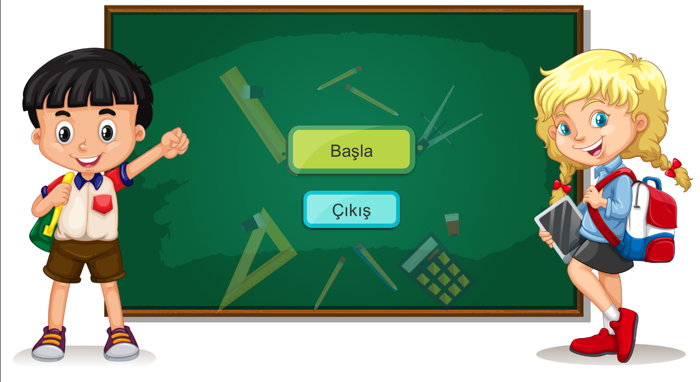
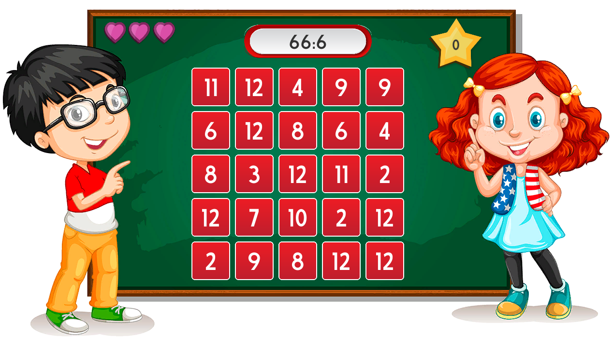
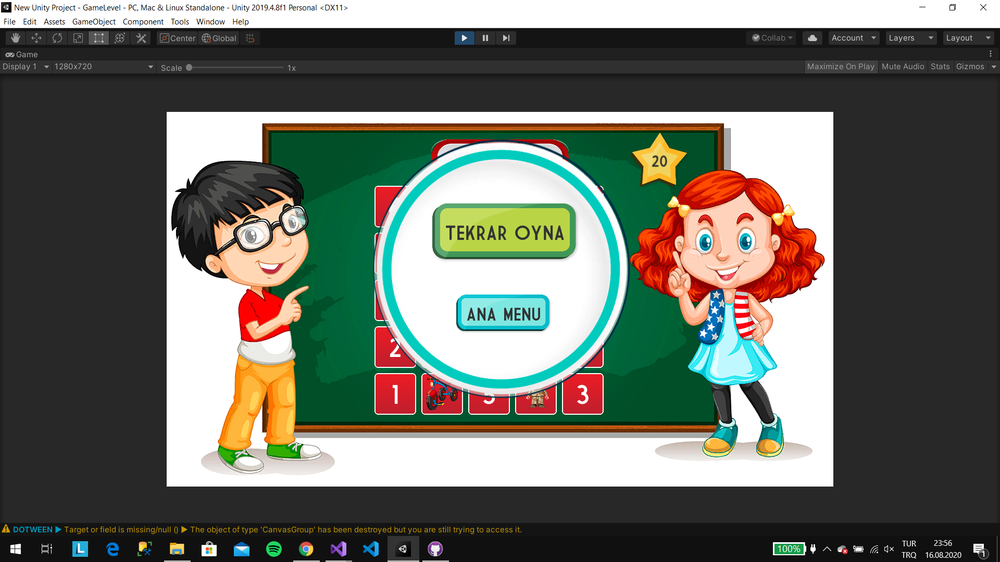

# Summary
This game project, which I developed on the Unity platform, is a project that can improve division skills for primary school students. You must select the result of the above procedure from the boxes below and proceed.

# Used Technologies
Unity , C# , DGTweening

# Images from Project

